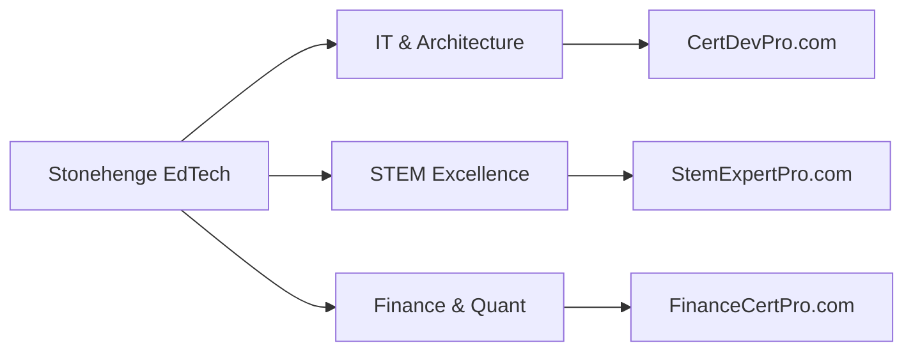

# 🗺️ Awesome Professional Roadmaps

> **A Curated Collection of Strategic Career Paths for Software Architecture, STEM, and Finance.**

Welcome to the central repository for high-level career blueprints, managed by **[Stonehenge EdTech](https://www.google.com/search?q=https://github.com/stonehenge-edtech)**. These roadmaps are distilled from 21+ years of CTO-level experience to help professionals navigate the complexities of modern engineering and financial systems.

---

## 🏛️ Our Specialized Pillars

We provide deep-dive roadmaps for three distinct professional trajectories:

### 1. 💻 IT & Software Architecture

*Driven by [CertDevPro*](https://CertDevPro.com)

* **Full-Stack Architect**: From junior developer to system designer.
* **Cloud & DevOps Mastery**: Navigating AWS, Azure, and Kubernetes ecosystems.
* **AI Engineering**: Building and deploying scalable machine learning pipelines.

### 2. 🔢 STEM & Competitive Logic

*Driven by [Stem Expert Pro*](https://github.com/stem-expert-pro)

* **Competitive Programming Path**: Mastery of USACO, CCC, and IOI algorithms.
* **Math & Logic Excellence**: Strategic preparation for AMC/AIME and beyond.
* **Robotics Engineering**: Professional workflows for VEX and FRC competitions.

### 3. 📈 Quantitative Finance

*Driven by [Finance Cert Pro*](https://www.google.com/search?q=https://github.com/finance-cert-pro)

* **Financial Analyst**: Deep prep for CFA and FRM certifications.
* **Quant Developer**: The intersection of high-frequency trading and software engineering.
* **FinTech Architect**: Building secure and scalable modern financial infrastructure.

---

## 🗺️ Master Roadmap Overview

---

## 💎 Why Follow Our Roadmaps?

* **Architectural Logic**: We don't just list skills; we focus on the underlying architectural "Why".
* **Production-Ready**: All paths are aligned with current industry standards and enterprise-level requirements.
* **Unified Ecosystem**: Seamlessly transition between domains under the Stonehenge EdTech umbrella.

---

## 🔗 Quick Access

* 🌐 **Corporate Portal**: [StonehengeEdTech.com](https://StonehengeEdTech.com)
* 📚 **Learning Hub**: [CertDevPro.com](https://CertDevPro.com)
* 📧 **Inquiries**: [github@stonehengedtech.com](mailto:github@stonehengedtech.com)

---

## 🤝 Contributing

Have a professional roadmap you'd like to share or an improvement for ours? Feel free to open a Pull Request!

---

### 🛡️ About Stonehenge EdTech

We leverage decades of technical leadership to provide professional-grade education. This project is hosted in our official `.github` repository to ensure maximum visibility across our organization.

---

© 2025 Stonehenge EdTech. All Rights Reserved.

**下一步：**
既然公开资源库已建立，您需要我为您撰写一份用于 **`edtech-infra-blueprints`** 的 README 吗？它可以向外界展示您作为 CTO 是如何使用 DevOps 思路来管理教育资产的。
